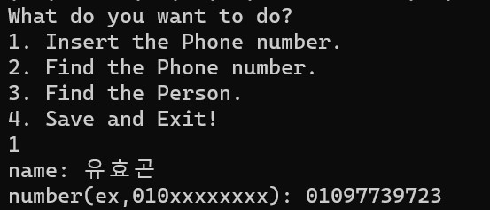
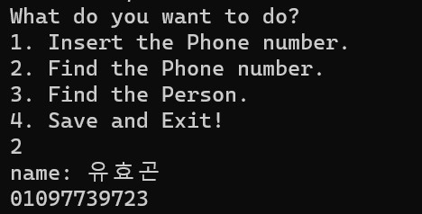
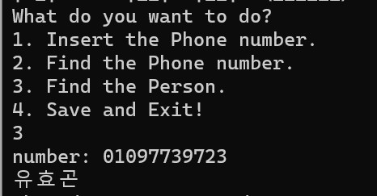

# SSE-Project
Secure Software Engineering Term Project

## 1. Phonebook

### Contents

```
project1.cpp : source code
phonebook.csv : phonebook file (if it doesn't exist, binary will make it.)
README.md : This Document(for explain software)
```

### How to build

```shell
$ g++ -o main project1.cpp
$ ./main
```

Just Build and Execute

### How to use

#### 초기화면

컴파일 후 파일을 실행할 시 다음과 같은 화면을 볼 수 있다.


#### menu

menu는 다음과 같이 총 4개이다. 

1. Insert the Phone number.
2. Find the Phone number.
3. Find the Person.
4. Save and Exit

이다.

1,2,3,4 이외의 입력을 줄 경우 Invalid Number  임을 알려주는 에러메세지를 출력한다.

#### 1. Insert the Phone number.



이름(name)과 전화번호(number)를 입력받는다.

이는 이후 Save and Exit!를 하였을 때, phonebook.csv에 저장되게 된다.

#### 2. Find the Phone number.



이름을 입력 받는다.

Phonebook에서 이름에 해당하는 전화번호를 찾아 출력한다.

#### 3. Find the Person



전화번호를 입력 받는다.

Phonebook에서 전화번호에 해당하는 이름를 찾아 출력한다.

#### 4. Save and Exit!


전화번호를 phonebook.csv에 저장한다.

만약, phonebook.csv 파일이 없으면 생성하고 이를 저장한다.

